# HLSL Tools for Visual Studio

[](https://gitter.im/tgjones/HlslTools)

*This extension is Visual Studio 2017 / 2019. [Go here for the Visual Studio Code extension](https://github.com/tgjones/HlslTools/tree/master/src/ShaderTools.VSCode).*

HLSL Tools is a 2017 / 2019 extension that provides enhanced support for editing High Level Shading Language (HLSL) files.

[](https://ci.appveyor.com/project/tgjones/hlsltools) [](http://www.issuestats.com/github/tgjones/hlsltools) [](http://www.issuestats.com/github/tgjones/hlsltools)

Download the extension at the [VS Gallery](https://visualstudiogallery.msdn.microsoft.com/75ddd3be-6eda-4433-a850-458b51186658) 
or get the [nightly build](http://vsixgallery.com/extension/7def6c01-a05e-42e6-953d-3fdea1891737/).

See the [changelog](CHANGELOG.md) for changes and roadmap.

### Why use HLSL Tools?

Since Visual Studio 2012, Visual Studio has shipped with basic support for editing HLSL files.
In addition to that basic feature set, HLSL Tools includes many more navigational and editing features:

| VS2017 / VS2019      | VS2017 / VS2019 with HLSL Tools |
| -------------------- | ------------------------------- |
| Syntax highlighting  | Syntax highlighting             |
| Automatic formatting | Automatic formatting            |
| Brace matching       | Brace matching                  |
| Brace completion     | Brace completion                |
| Outlining            | Outlining                       |
|                      | [Statement completion](#statement-completion) |
|                      | [Signature help](#signature-help) |
|                      | [Reference highlighting](#reference-highlighting) |
|                      | [Navigation bar](#navigation-bar) |
|                      | [Navigate to (Ctrl+,)](#navigate-to) |
|                      | [Live errors](#live-errors) |
|                      | [Go to definition](#go-to-definition) |
|                      | [Quick info](#quick-info) |
|                      | [Gray out code excluded by preprocessor](#preprocessor-support) |
|                      | [HLSL-specific preferences](#options) |

There are more features [on the roadmap](CHANGELOG.md).

### Features

#### Statement completion

Just start typing, and HLSL Tools will show you a list of the available symbols (variables, functions, etc.)
at that location. You can manually trigger this with the usual shortcuts: `Ctrl+J`, `Ctrl+Space`, etc.

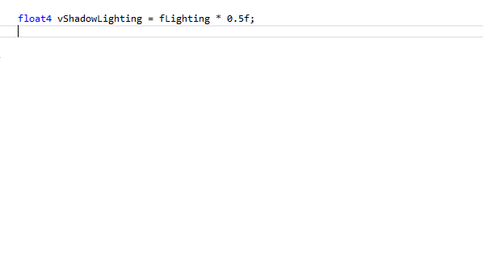

#### Signature help

Signature help (a.k.a. parameter info) shows you all the overloads for a function call, along with information (from MSDN)
about the function, its parameters, and return types. Typing an open parenthesis will trigger statement
completion, as will the standard `Ctrl+Shift+Space` shortcut. Signature help is available for all HLSL functions and methods,
including the older `tex2D`-style texture sampling functions, and the newer `Texture2D.Sample`-style methods.

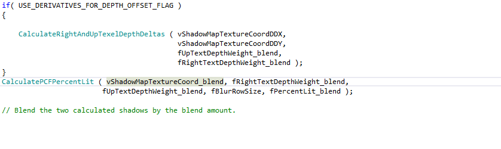

#### Reference highlighting

Placing the cursor within a symbol (local variable, function name, etc.) will cause all references to
that symbol to be highlighted. Navigate between references using `Ctrl+Shift+Up` and `Ctrl+Shift+Down`.

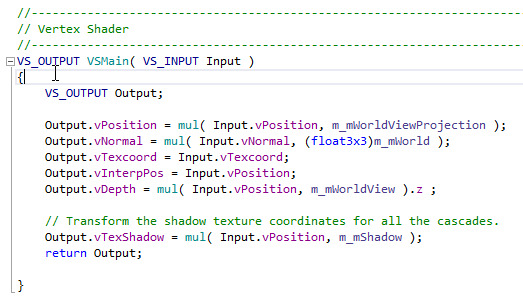

#### Navigation bar

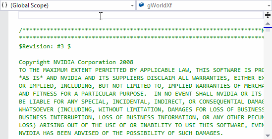

#### Navigate To

HLSL Tools supports Visual Studio's Navigate To feature. Activate it with `Ctrl+,`, and start typing the name
of the variable, function, or other symbol that you want to find.

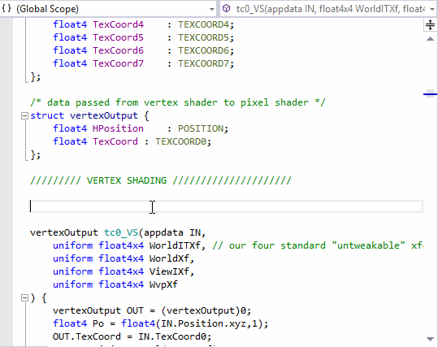

#### Live errors

HLSL Tools shows you syntax and semantic errors immediately. No need to wait till compilation!
Errors are shown as squigglies and in the error list.

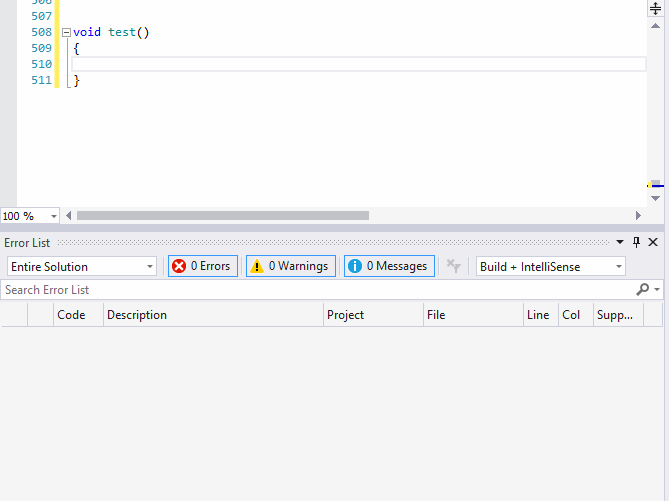

#### Go to definition

Press F12 to go to a symbol definition. Go to definition works for variables, fields, functions, classes,
macros, and more.

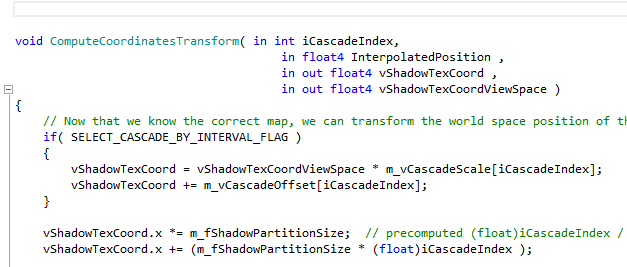

#### Quick info

Hover over almost anything (variable, field, function call, macro, semantic, type, etc.) to see a Quick Info tooltip.

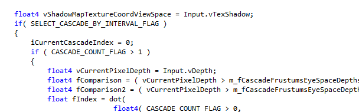

#### Preprocessor support

HLSL Tools evaluates preprocessor directives as it parses your code, and grays out excluded code.
If you want to make a code block visible to, or hidden from, HLSL Tools, use the `__INTELLISENSE__` macro:

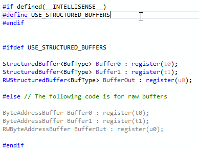

#### Options

Configure HLSL-specific IntelliSense and formatting options. If you really want to, you can disable IntelliSense altogether
and just use HLSL Tools' other features. You can also set HLSL-specific highlighting colours in 
Tools > Options > Environment > Fonts and Colors.

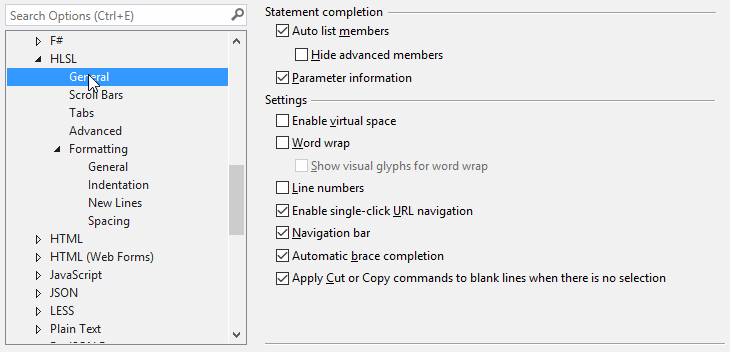

### Extras

#### The code

HLSL Tools includes a [handwritten HLSL parser](https://github.com/tgjones/HlslTools/blob/master/src/HlslTools).
It initially used an ANTLR lexer and parser,
but the handwritten version was faster, and offered better error recovery.

HLSL Tools has a reasonable test suite - although it can certainly be improved. Amongst more granular tests,
it includes a suite of 433 shaders, including all of the shaders from the DirectX and Nvidia SDKs.
If you want to contribute gnarly source files which push HLSL to its limit, that would be great!

#### Syntax visualizer

Inspired by Roslyn, HLSL Tools includes a syntax visualizer. It's primarily of interest to HLSL Tools developers,
but may be of interest to language nerds, so it's included in the main extension. Open it using `View > Other Windows > HLSL Syntax Visualizer`.

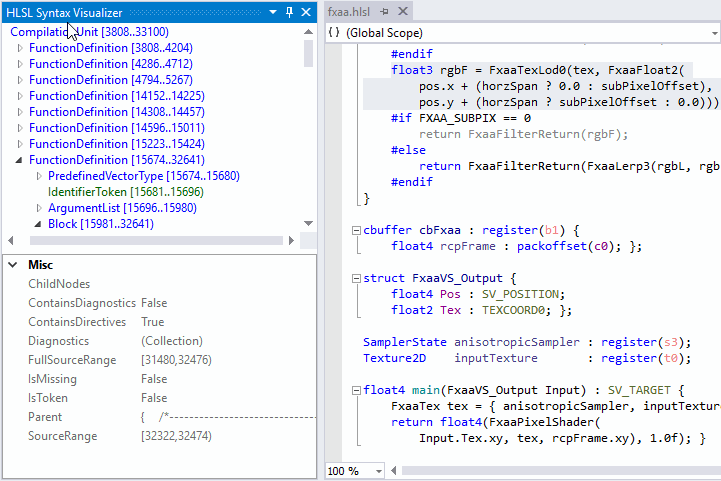

### Custom preprocessor definitions and additional include directories

HLSL Tools will, by default, only use the directory containing the source file to search for `#include` files.

You can customise this, and add additional preprocessor definitions, by creating a file named `shadertoolsconfig.json`:

``` json
{
  "hlsl.preprocessorDefinitions": {
    "MY_PREPROCESSOR_DEFINE_1": "Foo",
    "MY_PREPROCESSOR_DEFINE_2": 1
  },
  "hlsl.additionalIncludeDirectories": [
    "C:\\Code\\MyDirectoryA",
    "C:\\Code\\MyDirectoryB",
    ".",
    "..\\RelativeDirectory"
  ]
}
```

HLSL Tools will look for a file named `shadertoolsconfig.json` in the directory of an opened file,
and in every parent directory. A search for `shadertoolsconfig.json` files will stop when the drive
root is reached or a `shadertoolsconfig.json` file with `"root": true` is found. If multiple config
files are found during this search, they will be combined, with properties in closer files taking
precedence.

Config files are cached for performance reasons. If you make make changes to a config file,
you'll need to close and re-open any source files that use that config file.

### Getting involved

You can ask questions in our [Gitter room](https://gitter.im/tgjones/HlslTools).
If you find a bug or want to request a feature, [create an issue here ](https://github.com/tgjones/HlslTools/issues).
You can find me on Twitter at [@\_tim_jones\_](https://twitter.com/_tim_jones_) and I tweet about HLSL Tools using the
[#hlsltools](https://twitter.com/hashtag/hlsltools) hashtag.

Contributions are always welcome. [Please read the contributing guide first.](CONTRIBUTING.md)

### Maintainer(s)

* [@tgjones](https://github.com/tgjones)

### Acknowledgements

* Much of the code structure, and some of the actual code, comes from [Roslyn](https://github.com/dotnet/roslyn).
* [NQuery-vnext](https://github.com/terrajobst/nquery-vnext) is a nice example of a simplified Roslyn-style API,
  and HLSL Tools borrows some of its ideas and code.
* [Node.js Tools for Visual Studio](https://github.com/Microsoft/nodejstools) and
  [Python Tools for Visual Studio](https://github.com/Microsoft/PTVS) are amongst the best examples of how to build
  a language service for Visual Studio, and were a great help.
* [ScriptSharp](https://github.com/nikhilk/scriptsharp) is one of the older open-source .NET-related compilers,
  and is still a great example of how to structure a compiler.
* [LangSvcV2](https://github.com/tunnelvisionlabs/LangSvcV2) includes many nice abstractions for some of the more
  complicated parts of Visual Studio's language service support.